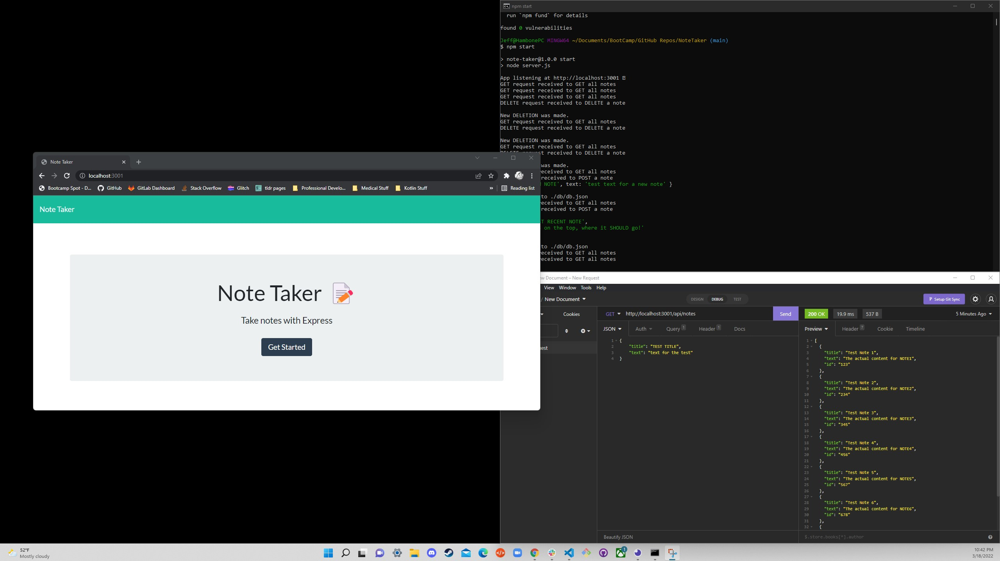
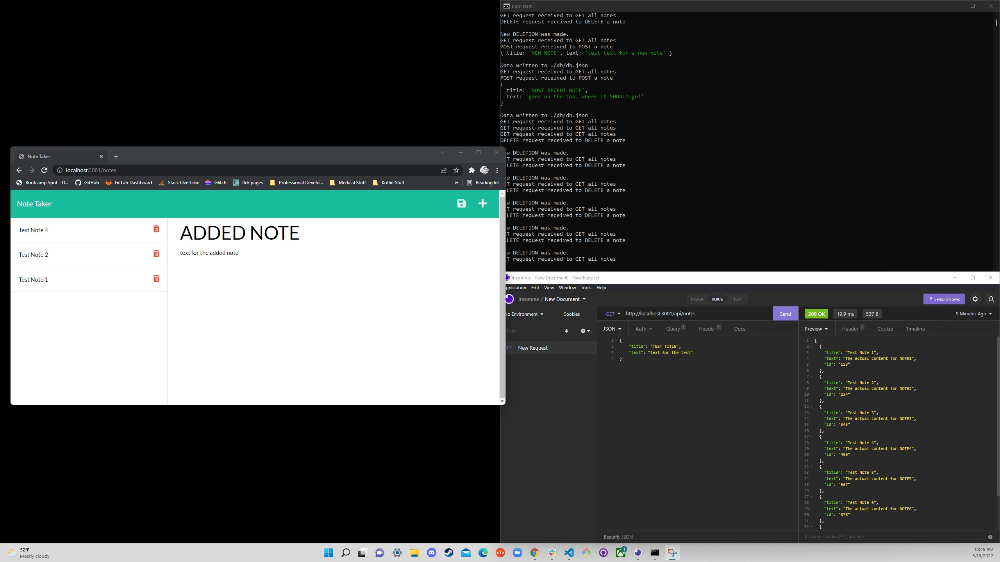
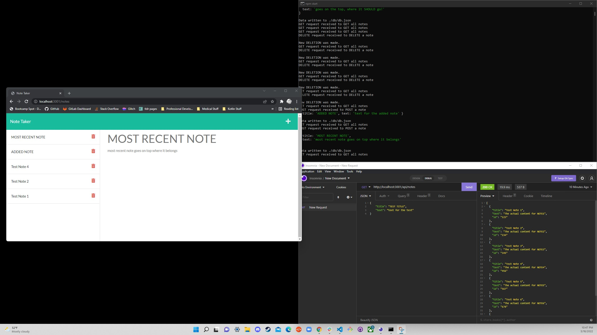

# NoteTaker
Deployed App:  https://notetaker-patrickfham.herokuapp.com/

## Description
- This browser-based note-taker is a quick and easy way to take down a thought to remember it later.  It even sorts your thoughts with the most recent on top!
- Front-End Tech Used:  HTML, CSS, BootStrap, FontAwesome, JavaScript
- Back-End / Server Tech Used:  NodeJS, express.js

## Setup Instructions
- NONE!  Navigate to https://notetaker-patrickfham.herokuapp.com/ , and you're good to go!

## Screenshots
- Landing Page
-- 

- Clicked Main Button to Navigate to Notes Page
-- 

- Deleted Some Notes
-- 

- Typed a New Note
-- 

- Typed a More Recent Note (to end up on TOP of the list)
-- 

## VIDEO DEMO
Full Operation, alongside terminal and Insomnia:  https://drive.google.com/file/d/1r8V-mFWZa2bpYB_gG8mcsnlnSqEpQeeM/view
